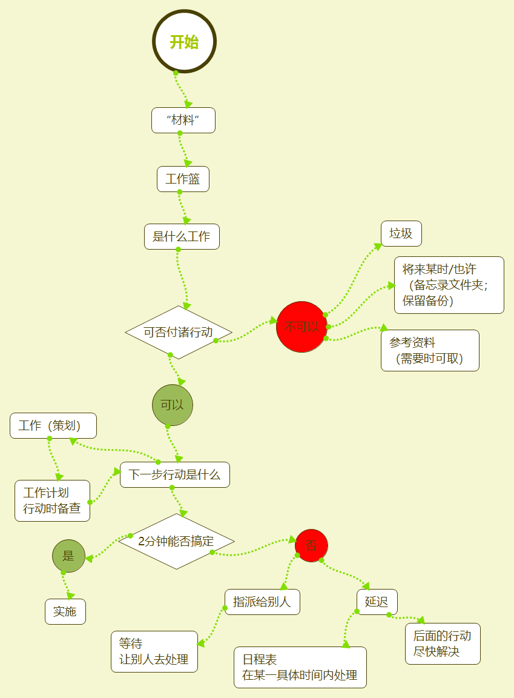

# 第2章 横向管理工作进程的5个阶段

> 我们所认知的知识已经在行动中证明了自己。我这里所谈的知识是指行动中的信息，以及关注结果的信息。

知识工作技巧的核心部分就是征服工作进程的5个阶段:

1. 收集一切引起我们注意力的事情；
2. 加工处理后，确定它们的实质以及解决方法；
3. 组织整理得出的结论；
4. 把它们列为我们行动的选择方案；
5. 行动，这就构成了我们生活中的“横向”管理层，随时添加新事务。

几个阶段存在的主要问题:

* 大多数人在收集工作中存在着重大的遗漏。
* 虽然很多人收集了大量信息，但是，他们却没有加工或确定需要采取哪些具体的行动。
* 另一些人一时作出了绝妙的决策，却由于缺乏对其结果的有效管理，从而丧失了思考的价值所在。
* 还有一些人建立起了良好的系统，但是没能坚持回顾和检查，结果导致它们无法发挥应有的功能。
* 最后，如果这些连接点中出现任何一个薄弱环节，决策方案都不可能是最佳的选择。

## 收集

了解需要收集哪些信息，以及如何富有成效地完成这一工作，这一点非常重要。

### 百分之百地捕获一切“未尽事宜”

确保一切必要的事情统统得到了收集并且存储在你大脑之外的某个地方。

### 收集工具

搜集一切具有潜在用途的信息、任务和行动方案

下面几种形式的工具可以用于捕捉你的想法以及从外部获取的资料：

* 具体的工作篮
* 书写用的纸张或记事簿
* 电子记事簿
* 音频产品
* 电子邮件
* 高科技产品设备

### 影响成功收集的因素

1. 每一个悬而未决的事情都必须存储于你的收集系统之中，而不是在你的大脑里。
2. 你应该尽可能地控制收集工具的数量，够用即可。
3. 你必须定期地清空这些设备。

### 把一切赶出你的大脑

收集工具应该成为你生活方式的一部分。

无论你身处何处，都可以随心所欲地抓住任何一个极具潜力和使用价值的好主意、妙点子，把它们视为你生活中不可或缺的一部分。

### 最大限度地减少收集设备的数量

> 一些品德高尚的天才人物在处理最少的问题时，却最为积极主动。

采用标准的工具和手段来捕捉一些想法和信息。

### 定期清空收集工具

如果不清空收集工具，加工处理里面盛放的“材料”，那么它就只是一个装满杂乱资料的仓库。

**核心思想**:不要让太多的琐碎事务停留在大脑里占用短期记忆，干扰大脑对当前事务的思考和处理，应该尽量利用其手段去记录零碎事务，释放大脑的能量集中精力把一件事情做好。

## 加工处理（工作管理的过程）

许多人试图把一切安排得“井井有条”，但是他们却错误地动手管理那些不完整的“材料”。你不可能整理组织那些即将降临的信息，你只能收集它们，加工它们。

此外，你必须以下一步行动的决策为依据，对即将采取的行动进行组织管理。整个过程—加工和组织阶段，体现在决策树型分析图的主干部分。

### 这是一件什么事情？

分析收集到的材料到底是什么，需要做些什么。

### 是否需要采取行动

决策事情的性质

#### 不需要采取行动

* 是一些根本没有用的垃圾。
* 目前没有采取行动的必要，但是日后可能需要处理（孵化，酝酿）。
* 该信息具有潜在的利用价值，今后也许能够派上用场（参考）。

#### 需要采取行动

* 你已经承诺完成哪些工作？需要达到什么样的结果？
* 下一步需要采取的行动是什么？

#### 如果是关于一项工作……

你必须在一个“工作”清单中体现出其结果。

#### 下一步行动是什么？

> 做事情时，并不需要花费很多气力，但是在决策行动时，却要求投入大量的精力。

“下一步行动”是指那些必须付诸实施的具体活动，它们推动着形势朝着既定目标前行。通常处理这件事，把这件事指派给别人处理，或者延迟处理.

行动是为了能够完成一项工作而分解的环节或步骤，因此要区分“一项工作”和“一步行动”，二者是有区别的概念，体现出来的是“大处着眼，小处着手”的理念。

下一步行动方案出台，紧接着，你面临三种选择：

* 处理这件事。如果你能够在不到2分钟的时间内就搞定它，那么，一旦这项工作被确定，你就应该立刻着手落实。
* 把这件事指派给别人去处理。如果处理这件事情需要花费的时间不止2分钟，那么，你应该问一问自己，你是否就是解决这个问题的最佳人选呢？如果回答是否定的，那就干脆委托给一个合适的人员去办理。
* 延迟处理。如果处理的时间超过了2分钟，而你又恰恰是最佳人选，这时，你不得不推迟行动，把它记录在某一个或者多个“下一个行动”的清单上。

## 组织管理（工作管理中的实体）

* 对于不可能采取行动的事务，划分为垃圾、孵化工具和参考资料存储器。
* 管理能够解决掉的事情，分类组织为工作任务清单、工作计划和资料、日程表、下一步行动的提示清单，以及所期待的回复信息的提示清单。

### 工作任务

> 工作的定义：任何一个由几个步骤构成的我们所期待的结果。

### “工作”清单

如果采取一个行动不足以完成一项工作的话，那么，你就需要提醒自己还有事情尚未处理。

这些工作不需要按照某一种特殊的顺序进行排列。你只需把它们列在一张主清单上，以便经常地查阅它们就足够了。这将确保你针对每一项任务制定出恰当的行动方案。

### 工作的辅助性资料

工作参考资料与辅助性资料按照主题或者题目分类组织整理，一道保存在同一个系统中。

### 下一步行动的种类

* 需要紧追不放的是那些将在某一个特定时间或日期里将要发生的事情（把它们记入你的日程表中）；
* 那些处理得越快越好的事情（把它们添加到你的“下一步行动”的清单中）；
* 以及所有你等待其他人去办理的事情（把这些填入“等候”目录中去）。

#### 日程表

将在某一具体的日期或时间里发生的事情。

日程表上一般标注三种情况：

* 在某一个确切的时间里采取的行动；
* 在某一个确切的日期里采取的行动
* 在某一个确切的日期里将要获取的信息；

> 具有灵活性的人是有福的，因为他们不会由于受到压力而不堪重负。

日程表可以进行灵活的调整

* 由于新情况持续不断地产生，策略重点不断地转移，每天的工作安排也必将随之作出相应的调整。
* 每日工作清单上的某一项工作不一定非要在这一天中完成，那么，它将起到弱化作用，对其他确确实实需要得到落实的工作产生一定的负面冲击。

日程表中安排的事情可以调整日期，但是事情必须去做。

#### “下一步行动”清单

应该即刻予以办理且越早动手越好的事情。

你所有的行动提示信息应该写在“下一步行动”清单中，连同日程表一起构成每日行动管理的核心结构。

> 我们应该使任何事物都变得越简单越好，而不是比较简单。

### 不能够立即落实的工作

对于一些不能够立即落实的事情，同样需要一个组织良好、自成一体的系统。这个系统可以进一步划分为三类：垃圾、孵化器和参考资料。

#### 垃圾

垃圾都是不证自明的。把一切没有潜在行动价值或者参考价值的东西统统扔掉。如果你继续保留着这些东西并与其他的资料混为一谈，这些垃圾资料将会严重地损害这个系统的正常运转。

#### 孵化器

还存在其他两类情况。它们同样不必立即投入行动，但是你仍然希望保存这些材料。

* “将来某时/也许”：于保存一些目前你不打算实施，但又希望在将来某一时间运作的工作。
* “备忘录”文件夹：保存备查资料的工具，“悬而未决”或者“有待继续跟踪”的文件夹。

#### 参考资料

* 特定主题或者特定领域的存储器；
* 一般性参考资料文件夹。

## 回顾

需要每隔一段时间，全面地回顾一下你自己的生活和工作的情况。（高手复盘）

### 回顾的内容和时机

> 根据你的需要，经常地回顾你的清单，把它们赶出你的大脑。

回顾使用GTD方法建立起个人的组织管理系统，要对系统的内容进行回顾，包括：

* 一个“工作任务”清单、
* 一个工作日历、
* “下一步行动”清单
* 一个“待处理”清单

### 成功的关键因素：每周查阅

> 生活中的事情涉及到大量的利益问题。一个人如果在考虑问题时不注意同其他人进行交流，那么，他就是一个空想家，对这个世界无从掌控。

每周查阅也就是做下列事情：

* 收集和加工处理所有的“材料”。
* 回顾和检查你的系统。
* 更新各类清单。
* 做到清洁、清楚、实时和完整。

> 大多数人在清理、了结、阐明了他们所有的协议，并与别人重新审议了这些协议后，都会感到心满意足、状态良好。注意周都要坚持这样做，而不是每年。

## 行动

> 每一个行动决策都是凭直觉作出的。问题在于，如何从希望这个选择是正确的过渡到对它的正确性深信不疑。

### 选择行动方案的三个范例

> 当你需要处理的事情远远地超越了你的应付能力，你需要做的便是相信自己的选择。

#### 1.在某一时刻，决策行动的4个标准的模式

你可以按照次序采用下面4个标准：

* 环境：大多数事情的处理需要某一个明确的地点（在家或办公室）或者要求某些辅助设备，如一部电话机、一台电脑。而这些因素首先限制了目前可能作出的选择。
* 有多少时间：在什么时候你必须去处理其他的事情呢？如果5分钟后你就必须去开会，你现在就不可能去解决许许多多耗时持久的事情。
* 有多少精力：你有多少精力呢？某些事情需要你精力旺盛、标新立异、富于创造力；而另一些则要求更加充沛的体力；还有一些事情对两者都无过分的苛求。
* 重要性：考虑到你目前的情况、可以支配的时间和现在的精神状况，选择哪一件事能够获取最高的回报呢？

#### 2.评估每日工作的3种模式

当你着手处理事务，也就是人们在一般情况下提到的“工作”时，你可能是在从事以下3种不同类型的活动：

* 处理事先安排好的工作：按照“下一步行动”清单不断地向前推进着，落实那些你早已经确定了的行动，控制工作流程的运转。
* 处理随时冒出来的事件：有一些事情会突如其来地钻出来，你不得不应付这些紧急情况，而有时你是主动选择去这样做的。
* 定义你自己的工作：明确你的工作，明确那些今后需要关注而目前又不需要立刻采取措施的事情。

#### 3.回顾和检查工作6个标准的模式

为了明确到底哪些工作才是最重要的，我们必须首先搞懂我们的工作到底是什么。至少可以从6个不同的角度加以衡量。我们可以高度的概念进行类比：

* 5万英尺以上：生活，这就是我们整个生活的全景。
* 4万英尺：3~5年的展望，展望未来3~5年的发展前景，你必定会从一个更加广阔的角度着眼：管理策略、周边环境发展的趋势、事业和生活转变的条件。
* 3万英尺：1~2年的目标，从现在起1~2年内，你希望在生活和工作的各个领域达到哪些目标，这为你定义工作又创造了一个崭新的领域。
* 2万英尺：责任范围，自身承担的种种责任和义务，致使你承受了先前的大部分工作
* 1万英尺：当前的工作，希望在相当短的时间内取得成效的事情
* 跑道：目前的行动，体现为工作清单，记录了你需要处理的一切事务